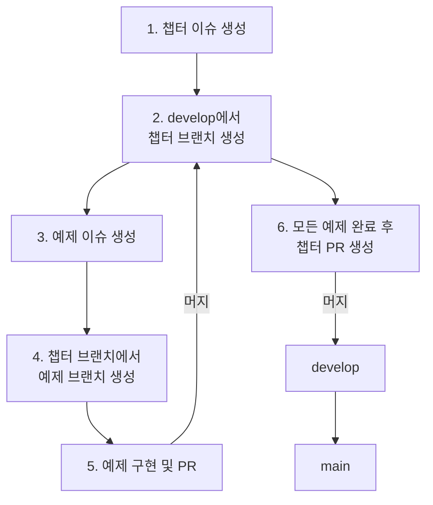

# LangGraph 학습 프로젝트

LangChain 및 LangGraph 기술을 학습하고 실험하기 위한 프로젝트입니다.

## 📖 개요 (Overview)

이 프로젝트는 챕터(Chapter)와 예제(Example) 단위로 개발을 진행합니다. 각 챕터는 하나의 주제를 다루며, 여러 개의 구체적인 예제를 포함합니다. 모든 기여는 표준화된 이슈 및 PR 템플릿을 통해 관리하여 협업 효율성을 높입니다.

## ⚙️ 개발 워크플로우 (Development Workflow)

프로젝트의 전체 개발 흐름은 아래 다이어그램을 따릅니다.

 

## 🌿 브랜치 전략 (Branch Strategy)

브랜치 이름은 다음 규칙에 따라 지정합니다.

| 브랜치 종류 | 목적 | 이름 규칙 | 예시 |
| --- | --- | --- | --- |
| **main** | 최종 안정화 버전 | `main` | - |
| **develop** | 챕터 단위 통합 | `develop` | - |
| **Chapter** | 챕터 개발 | `chapter/<issue-number>-<chapter-slug>` | `chapter/1-tool-calling-agent` |
| **Example** | 예제 개발 | `feature/<chapter-slug>/<example-slug>` | `feature/tool-calling-agent/01-concept`|

 

## 🎫 이슈 관리 (Issue Management)

이슈는 **챕터**와 **예제** 두 가지 유형으로 관리하며, `.github/ISSUE_TEMPLATE`에 정의된 템플릿을 사용합니다.
**이슈 생성 시, 해당 이슈에서 사용할 브랜치 이름을 템플릿에 명시해야 합니다.**

| 이슈 종류 | 제목 규칙 | 목적 | 템플릿 |
| --- | --- | --- | --- |
| **Chapter** | `[Chapter] <챕터 제목>` | 챕터 전체 범위 및 목표 관리 | `chapter-template.md` |
| **Example** | `[Example] <예제 제목>` | 예제 단위 작업 및 목표 관리 | `example-template.md` |

 

## 🚀 Pull Request (PR) 규칙

PR은 예제와 챕터 단위로 나누어 요청하며, `.github/PULL_REQUEST_TEMPLATE`에 정의된 템플릿을 사용합니다.

| PR 종류 | 브랜치 | PR 제목 규칙 | 템플릿 |
| --- | --- | --- | --- |
| **Example** | `feature/...` → `chapter/...` | `[Example] <예제 제목>` | `example-pr-template.md` |
| **Chapter** | `chapter/...` → `develop` | `[Chapter] <챕터 제목>` | `chapter-pr-template.md` |

**중요**: PR 본문에는 반드시 `Closes #<이슈번호>`를 포함하여 관련 이슈가 자동으로 종료되도록 설정해야 합니다.

 

## 📝 작업 흐름 상세 예시

1.  **챕터 이슈 생성**: `[Chapter] LangChain 에이전트` 이름으로 챕터 이슈를 생성합니다. (예: 이슈 #1)
2.  **챕터 브랜치 생성**: 로컬 `develop` 브랜치를 기준으로 `chapter/1-langchain-agent` 브랜치를 생성합니다.
3.  **예제 이슈 생성**: `[Example] 기본 에이전트 구현` 이름으로 예제 이슈를 생성합니다. (템플릿에 `Parent Chapter: #1` 추가)
4.  **예제 브랜치 생성**: `chapter/1-langchain-agent` 브랜치를 기준으로 `feature/langchain-agent/01-basic-agent` 브랜치를 생성합니다.
5.  **예제 구현**: 예제 코드를 작성하고 커밋합니다.
6.  **예제 PR 생성**:
    *   `feature/langchain-agent/01-basic-agent` → `chapter/1-langchain-agent`로 PR을 요청합니다.
    *   PR 제목은 `[Example] 기본 에이전트 구현`으로 작성하고, 본문에 `Closes #2`를 추가합니다.
7.  **코드 리뷰 및 병합**: 리뷰 완료 후 예제 PR을 챕터 브랜치에 병합합니다.
8.  **챕터 완료 및 PR**:
    *   모든 예제가 챕터 브랜치에 병합되면, `chapter/langchain-agent` → `develop`로 PR을 요청합니다.
    *   PR 제목은 `[Chapter] LangChain 에이전트`로 작성하고, 본문에 `Closes #1`을 추가합니다.
9.  **최종 병합**: 최종 리뷰 후 `develop`에 병합하고, 릴리즈 시점에 `main` 브랜치에 병합합니다.
