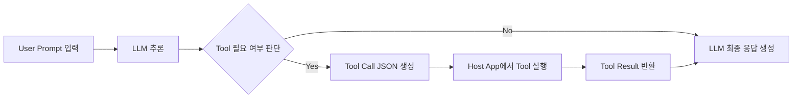
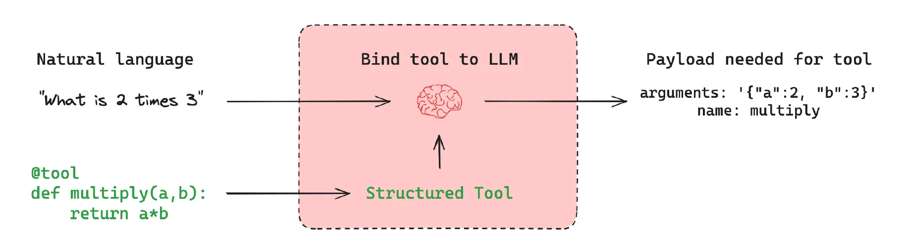
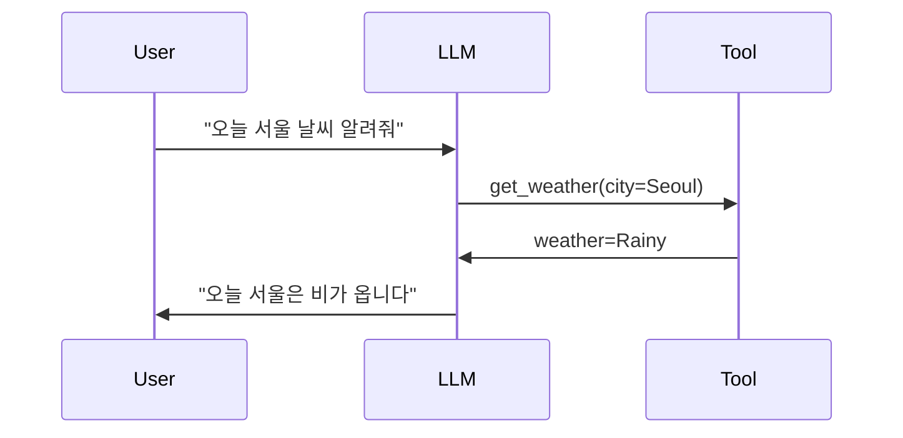
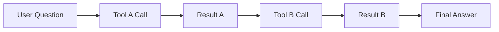
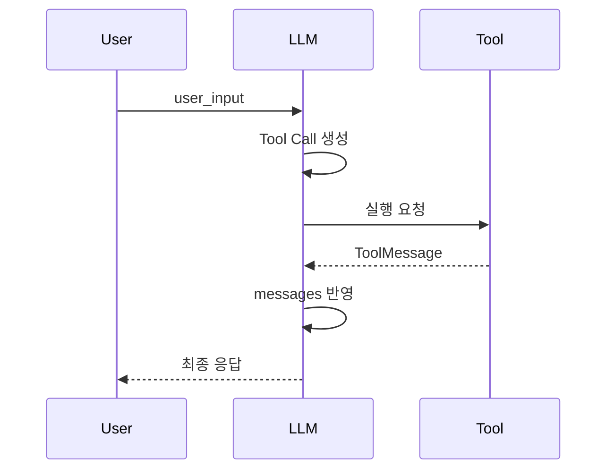

# Tool Calling(도구 호출)

<aside>

본 문서는 **하나의 예제를 따라가며 Tool Calling의 개념과 라이프사이클을 이해하는 것**을 목표로 한다.

---

**미리 요약**

- Tool Calling은 **LLM 기능이 아니라 실행 패턴**이다
- 핵심은 Tool이 아니라 **Message Lifecycle**이다
- Multi-Step 구조는 선택이 아니라 **필수**다
</aside>

## **1. Tool Calling이란 무엇인가**

**Tool Calling**은 LLM이 사용자 질문을 보고, 아래처럼 판단하여 **도구 실행 요청을 구조화된 형태로 생성하는 메커니즘**이다.

> **“이 질문을 답하려면 외부 도구의 도움이 필요하다”**
> 
> 
> → **`LLM`이 자연어 입력을 해석하여 외부 도구 API를 호출할 수 있도록**
> 
> **입력을 구조화된 자료 형태인 Schema 형태로 변환하는 메커니즘**
> 

### **중요한 점은 다음과 같다.**

- LLM은 도구를 **실행하지 않는다**
- LLM은 도구를 **선택하고 호출 요청만 생성**한다
- 실제 실행과 재호출은 **체인이 담당**한다

### 도구의 필요성 ( **LLM의 한계 보완 )**

| 필요성 | 설명 |
| --- | --- |
| 실시간성 | 검색, 가격, 뉴스 등 |
| 특수 기능 | 계산, DB 조회, 외부 API |
| 정확성 | LLM 추론 + 실제 데이터 결합 |

- 최신 정보 부족
- 실시간 데이터 접근 불가
- 외부 시스템 연동 불가

---

## 2. Tool Calling 라이프사이클

**요약**: `Tool Calling`은 ***LLM 내부 판단 + 외부 실행***이 결합된 **2단 구조**다.



---

## 3. Tool Calling을 구성하는 핵심 개념들

### 3.1 Tool (도구)

- **`LLM`**에게 **"이런 기능이 있다"고 알려주는 메타데이터**
- 실제로는 `Python 함수`, `API`, `DB 쿼리` 등 무엇이든 가능

핵심은 **실행 주체는 LLM이 아니라 Host Application**이라는 점이다.

<aside>

### Tool의 필수 속성

> `name`과 `description`은 **프롬프트 내부로 주입되므로 매우 중요**
> 

| 속성 | 설명 |
| --- | --- |
| `name` | 도구 식별자 |
| `description` | LLM이 도구 역할을 이해하는 핵심 힌트 |
| `args_schema` | 입력 JSON Schema |
| `function` | 실제 실행 로직 ( 선택적으로 비동기 함수도 가능 ) |

### 기본 동작 구조



<aside>

**Input**

- `“What is 2 times 3”`

**LLM이 가진 Tool**

- **”multiply란 이름의 곱하기를 수행하는 함수, 인자는 a, b**

---

**LLM이 Tool이 사용하는 Schema에 맞게 구조화**

- name: `multiply`
- arguments: `{"a":2, "b":3}`

**이후 Tool 호출**

</aside>

---

**Tool Schema**

Tool은 반드시 **구조화된 입력 스펙**을 가진다.

> LLM이 **자연어 → 구조화된 JSON**으로 변환할 수 있게 만드는 핵심 장치
> 

```python
{
	"name": "search_web",
	"description": "Search query on the web",
	"parameters": {
		"type": "object",
		"properties": {
		"query": { "type": "string" }
		},
		"required": ["query"]
	}
}
```

</aside>

### 3.2 Prompt

`Prompt`는 단순한 지시문이 아니라, **메시지 흐름을 담는 그릇**이다.

```python
prompt = ChatPromptTemplate([
	("system", "You are a helpful AI assistant."),
	("human", "{user_input}"),
	("placeholder", "{messages}"),
])
```

### placeholder(messages)의 역할

| 시점 | messages 상태 |
| --- | --- |
| 최초 LLM 호출 | 비어 있음 |
| Tool Call 이후 | AIMessage 포함 |
| Tool 실행 후 | ToolMessage 누적 |

**핵심:** Tool Calling에서는 LLM이 **같은 Prompt로 여러 번 실행**되며, `placeholder`는 이전 실행 결과를 다시 전달하기 위한 슬롯이다.

### 3.3 Prompt와 Tool Calling의 관계

`Prompt`는 단순 지시문이 아니다.

- 어떤 도구가 있는지
- 언제 도구를 사용해야 하는지
- 도구 결과를 어떻게 활용해야 하는지

를 **암묵적으로 학습시키는 컨텍스트**다.

### 3.4 Tool 실행은 언제, 누가 하는가

Tool 실행은 반드시 다음 조건을 만족해야 한다.

- LLM이 생성한 `tool_call` 존재
- 해당 호출 정보를 체인이 해석

```python
**LLM (요청 생성) → Chain (실행) → Tool (결과 반환)**
```

Tool의 결과는 **ToolMessage** 형태로 반환된다.

---

## 4. Tool Binding은 무엇을 의미하는가

### 4.1 개념 정의

> `Tool Binding`은 "이 LLM은 이 도구들을 사용할 수 있다"는 실행 환경 구성 단계다.
> 
> 
> ---
> 
> ❗ Tool을 실행하는 주체는 항상 **체인**이다.
> 

```python
llm_with_tools = llm.bind_tools([web_search])
```

- "이 LLM은 이런 도구들을 사용할 수 있다"는 **선언 = Prompt와는 별개**
- 실행 ❌, 호출 ❌ = 런타임 설정에 가깝다
- 선택 가능성만 부여

```mermaid
LLM + Tool Set = Tool-Enabled Model
```

---

## 5. Single-Step Tool Call (불완전한 패턴)

### 5.1 개념

> **하나의 Tool Call → 하나의 Tool Result → 하나의 최종 답변**
> 
> 
> ---
> 
> **Tool Calling의 가장 기본이 되는 형태**
> 



```python
ai_msg = llm_chain.invoke({"user_input": question})
```

### 이 상태를 무엇이라 부르는가?

> `Single-Step Tool Call`
> 
- **Tool 실행 요청까지만 생성**
- **Tool 결과를 해석할 기회가 없음**

---

## 6. Multi-Step Tool Chain

### 6.1 개념

> Tool 결과가 있어도, LLM은 이를 **본 적이 없다**. 이를 해소하기 위한 방식
> 
> 
> **이전 Tool 결과를 바탕으로 다음 Tool 호출이 연쇄적으로 발생**
> 



따라서 반드시:

1. Tool 결과를 messages에 누적하고
2. LLM을 다시 실행해야 한다

```python
llm_chain.invoke({
	"user_input": question,	
	"messages": [ai_msg, *tool_msgs]
})
```

이 패턴을 **`Multi-Step Tool Execution Chain`**이라 부른다.

이 단계부터 **Agent / LangGraph의 필요성**이 자연스럽게 등장한다.

---

## 7. Message Lifecycle 정리



**요약:** messages는 LLM의 기억이 아니라, **사고 이력 전달 매체**다.

---

## 8. 핵심 개념 한눈에 보기

| 개념 | 설명 |
| --- | --- |
| `Tool Calling` | LLM이 도구 사용을 판단하는 메커니즘 |
| `Prompt 세팅` | 다단계 실행을 위한 메시지 구조 |
| `Tool Binding` | 사용 가능한 도구 선언 |
| `Single-Step Call` | Tool 요청까지만 생성된 상태 |
| `Multi-Step Chain` | Tool 결과까지 반영된 완전한 실행 |